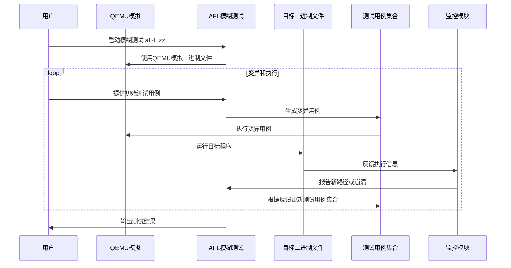

```mermaid
sequenceDiagram
    participant User as 用户
    participant QEMU as QEMU模拟
    participant AFL as AFL模糊测试
    participant TargetBin as 目标二进制文件
    participant TestSuite as 测试用例集合
    participant Monitor as 监控模块

    User->>AFL: 启动模糊测试 afl-fuzz
    AFL->>QEMU: 使用QEMU模拟二进制文件
    loop 变异和执行
        User->>AFL: 提供初始测试用例
        AFL->>TestSuite: 生成变异用例
        TestSuite->>QEMU: 执行变异用例
        QEMU->>TargetBin: 运行目标程序
        TargetBin->>Monitor: 反馈执行信息
        Monitor->>AFL: 报告新路径或崩溃
        AFL->>TestSuite: 根据反馈更新测试用例集合
    end
    AFL->>User: 输出测试结果
```